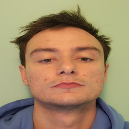
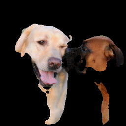
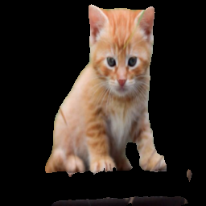

#### CS410 Final Project, Fall 2019
#### Pramav Velamakanni (pranavv2@illinois.edu), Tarik Koric (koric1@illinois.edu)

## Technical document explaining the app that lets users access the trained models

### Introduction

The aim of this project is to train models that are capable of isolating backgrounds from images. This is achieved by training 3 models with unique data sets and a fourth model which combines all three data sets. 

Each training data set contains around 800 RGB images for a total of 2400 images for all 3 models. The first set includes images of people, the second and third include images of cats and dogs respectively. This data has been compiled by us. The dataset can be downloaded from - https://amoeba.wolfram.com/index.php/s/StYiCHLLY2PMGLJ

Each image undergoes 3 layers of pre-processing for training, the first step involves isolating the background using existing tools like Photoshop and an online tool called background.bg. Once the background has been isolated, a mask is created. The final step involves loading the image, resizing and converting it into a vector ready for training.

The model used in this project is U-net, first designed in 2015, which is an extension of the traditional convolutional neural network. It is primarily used to process biomedical images. U-nets address the segmentation issue when dealing with image data that requires us to not only answer a binary question but also localize the area within the image. This is achieved by performing classification on every pixel so the input and output image share the same size.

Accuracy of models:
- U-net with all images - 79 %
- U-net with people images - 87.95 %
- U-net with cat images - 78.74 %
- U-net with dog images - 80.27 %

*NOTE: Image pre-processing, training and model design is available in the notebook `TrainModel.ipynb`. Training can take several hours based on the system configuration. Due to the size of the data and trained models, this data is not included in the workspace. Please refer to dowonload links section below.*

This program provides an API to access the trained models. User has the option to pick any of the 4 models to predict results for images for a single file, a directory of images or a URL that points to the image.

### Tools used in this project

- `Python 3.7`
- `Jupyter` - notebooks used to train and test the models
- `Keras` - used to train and save the model
- `TensorFlow` - backend used for training the neural network
- `scikit-image` - URL image import
- `opencv-python` - image manipulation
- `Pandas, NumPy` - load, manipulate and pre-process images for training
- `scikit-learn` - prepare training and test data sets
- `scipy` - misc tools used to resize images
- `Matplotlib` - tool to visualize the results

*Please Note: This app requires that the matching version of Scipy, Keras and TensorFlow are used. There could be import failures otherwise. The provided `requirements.txt` file includes the libraries and corresponding version numbers.`*

### Set up the enviornment to use this application

#### Method 1 (pip)

Please ensure you have Python 3 installed

The following command can be run to install all the dependencies (using `pip`) needed for this app to run.

`pip install --requirement requirements.txt`

#### Method 2 (Conda environment)

If you have [Anaconda](https://www.anaconda.com/distribution/) installed, the dependencies can be installed to a custom enviornment (ideal if you have other projects using different versions of the libraries)

Create the environment:  `conda create -n TeamWolfram python=3.7`

Activate the environment:  `conda activate TeamWolfram`

From this project workspace execute: `pip install --requirement requirements.txt`

### Download links

`Original training data (data directory)`: https://amoeba.wolfram.com/index.php/s/StYiCHLLY2PMGLJ

`Trained models (models directory)`: https://amoeba.wolfram.com/index.php/s/YLB3koFBGfkkz3B

### Files in this workspace

- `app.py` - Main application file that interacts with the models
- `TrainModel.ipynb` - This notebook contains the pre-processing and model training
- `requirements.txt` - File containing the Python requirements for this project
- `CS445_Final_Project_Report.pdf` - project report
- `data/` directory (Misc: tests performed while testing and tweaking the application, directory not included in the workspace)
    - `person` - folder containing the original images
    - `person_remove` - folder containing the images with backgrounds removed
    - `person_mask` - folder containing the masks of the images
    - `cat` - folder containing the original images
    - `cat_remove` - folder containing the images with backgrounds removed
    - `cat_mask` - folder containing the original images
    - `dog` - folder containing the original images
    - `dog_remove` - folder containing the images with backgrounds removed
    - `dog_mask` - folder containing the original images
- `models/` directory (not included in the workspace, refer to the download links section)
    - `all.h5` - Saved model trained on all datasets
    - `people.h5` - Saved model trained on the people dataset
    - `cat.h5` - Saved model trained on the cat dataset
    - `dog.h5` - Saved model trained on the dog dataset

### How to use the app

- `app.py` is a command line app that supports the following arguments
    - Input file formats
        - `--file` or `-f` - full path to the image in the system
        - `--dir` or `-d` - full path to the directory in the system containing images (no maximum threshold enforced)
        - `--url` or `-u` - URL to the source of image (*NOTE: this URL should directly point to the image.*)
    - Model selection
        - `--mode` - defaults to `all`, available models: `people`, `dog`, `cat`. (*NOTE: accuracy is higher when the mode is provided for a known image matching the category*) 
    - Supported operations
        - `--visualize` - displays the final prediction. Defaults to false. (*NOTE: visualize flag is not advised when processing a directory as the input since this will cause many windows to pop up to display the images.*)
        - `--write-to-file` - saves the final image as a file, the source input filename is taken. Results are stored in the `results/` directory.
        - `--summary` - provides a summary of all layers used in the neural network. 

### To train the model

The trained models are saved as H5 files which can be loaded to predict.

To train the model from scratch, download the data from https://amoeba.wolfram.com/index.php/s/StYiCHLLY2PMGLJ and extract the data to a folder named `data` in the workspace. The code in the notebook assumes `data/` as the default directory containing the training images.

### Examples of new image predictions using the trained models

*NOTE: Images used for the tests are included in the `test/` directory. The corresponding results are included in the `results/` directory.*

#### Using an image file as the input parameter with visualize and write to file enabled, model set to people

```
❯ python app.py --file "test/elon.jpg" --visualize --write-to-file --mode "people"
```


```
❯ python app.py --file "test/pranav.png" --visualize --write-to-file --mode "people"
```


#### Using an image file as the input parameter with visualize and write to file enabled, model set to default (model trained on all datasets)

```
❯ python app.py --file "test/tarik.png" --visualize --write-to-file --mode "people"
```




#### Using an image (2 objects of interest) URL as the input parameter with visualize and write to file enabled, model set to default (model trained on all datasets)

```
❯ python app.py --url "https://www.clubk9.com/wp-content/uploads/2018/04/shutterstock_71053309-1-256x256.jpg" --visualize
```




#### Using an image (cat) URL as the input parameter with visualize and write to file enabled, model set to default (model trained on all datasets)

```
❯ python app.py --url "https://i.pinimg.com/originals/89/7b/65/897b65d52d49a7e423760200949b8fdb.jpg" --visualize --write-to-file
```




### Model summary

```
__________________________________________________________________________________________________
Layer (type)                    Output Shape         Param #     Connected to
input_24 (InputLayer)           (None, 256, 256, 3)  0
__________________________________________________________________________________________________
conv2d_496 (Conv2D)             (None, 256, 256, 64) 1792        input_24[0][0]
__________________________________________________________________________________________________
conv2d_497 (Conv2D)             (None, 256, 256, 64) 36928       conv2d_496[0][0]
__________________________________________________________________________________________________
max_pooling2d_89 (MaxPooling2D) (None, 128, 128, 64) 0           conv2d_497[0][0]
__________________________________________________________________________________________________
conv2d_498 (Conv2D)             (None, 128, 128, 128 73856       max_pooling2d_89[0][0]
__________________________________________________________________________________________________
conv2d_499 (Conv2D)             (None, 128, 128, 128 147584      conv2d_498[0][0]
__________________________________________________________________________________________________
max_pooling2d_90 (MaxPooling2D) (None, 64, 64, 128)  0           conv2d_499[0][0]
__________________________________________________________________________________________________
conv2d_500 (Conv2D)             (None, 64, 64, 256)  295168      max_pooling2d_90[0][0]
__________________________________________________________________________________________________
conv2d_501 (Conv2D)             (None, 64, 64, 256)  590080      conv2d_500[0][0]
__________________________________________________________________________________________________
max_pooling2d_91 (MaxPooling2D) (None, 32, 32, 256)  0           conv2d_501[0][0]
__________________________________________________________________________________________________
conv2d_502 (Conv2D)             (None, 32, 32, 512)  1180160     max_pooling2d_91[0][0]
__________________________________________________________________________________________________
conv2d_503 (Conv2D)             (None, 32, 32, 512)  2359808     conv2d_502[0][0]
__________________________________________________________________________________________________
max_pooling2d_92 (MaxPooling2D) (None, 16, 16, 512)  0           conv2d_503[0][0]
__________________________________________________________________________________________________
conv2d_504 (Conv2D)             (None, 16, 16, 1024) 4719616     max_pooling2d_92[0][0]
__________________________________________________________________________________________________
conv2d_505 (Conv2D)             (None, 16, 16, 1024) 9438208     conv2d_504[0][0]
__________________________________________________________________________________________________
up_sampling2d_86 (UpSampling2D) (None, 32, 32, 1024) 0           conv2d_505[0][0]
__________________________________________________________________________________________________
conv2d_506 (Conv2D)             (None, 32, 32, 512)  2097664     up_sampling2d_86[0][0]
__________________________________________________________________________________________________
concatenate_85 (Concatenate)    (None, 32, 32, 1024) 0           conv2d_503[0][0]
                                                                 conv2d_506[0][0]
__________________________________________________________________________________________________
conv2d_507 (Conv2D)             (None, 32, 32, 512)  4719104     concatenate_85[0][0]
__________________________________________________________________________________________________
conv2d_508 (Conv2D)             (None, 32, 32, 512)  2359808     conv2d_507[0][0]
__________________________________________________________________________________________________
up_sampling2d_87 (UpSampling2D) (None, 64, 64, 512)  0           conv2d_508[0][0]
__________________________________________________________________________________________________
conv2d_509 (Conv2D)             (None, 64, 64, 256)  524544      up_sampling2d_87[0][0]
__________________________________________________________________________________________________
concatenate_86 (Concatenate)    (None, 64, 64, 512)  0           conv2d_501[0][0]
                                                                 conv2d_509[0][0]
__________________________________________________________________________________________________
conv2d_510 (Conv2D)             (None, 64, 64, 256)  1179904     concatenate_86[0][0]
__________________________________________________________________________________________________
conv2d_511 (Conv2D)             (None, 64, 64, 256)  590080      conv2d_510[0][0]
__________________________________________________________________________________________________
up_sampling2d_88 (UpSampling2D) (None, 128, 128, 256 0           conv2d_511[0][0]
__________________________________________________________________________________________________
conv2d_512 (Conv2D)             (None, 128, 128, 128 131200      up_sampling2d_88[0][0]
__________________________________________________________________________________________________
concatenate_87 (Concatenate)    (None, 128, 128, 256 0           conv2d_499[0][0]
                                                                 conv2d_512[0][0]
__________________________________________________________________________________________________
conv2d_513 (Conv2D)             (None, 128, 128, 128 295040      concatenate_87[0][0]
__________________________________________________________________________________________________
conv2d_514 (Conv2D)             (None, 128, 128, 128 147584      conv2d_513[0][0]
__________________________________________________________________________________________________
up_sampling2d_89 (UpSampling2D) (None, 256, 256, 128 0           conv2d_514[0][0]
__________________________________________________________________________________________________
conv2d_515 (Conv2D)             (None, 256, 256, 64) 32832       up_sampling2d_89[0][0]
__________________________________________________________________________________________________
concatenate_88 (Concatenate)    (None, 256, 256, 128 0           conv2d_497[0][0]
                                                                 conv2d_515[0][0]
__________________________________________________________________________________________________
conv2d_516 (Conv2D)             (None, 256, 256, 64) 73792       concatenate_88[0][0]
__________________________________________________________________________________________________
conv2d_517 (Conv2D)             (None, 256, 256, 64) 36928       conv2d_516[0][0]
__________________________________________________________________________________________________
conv2d_518 (Conv2D)             (None, 256, 256, 1)  65          conv2d_517[0][0]
==================================================================================================
Total params: 31,031,745
Trainable params: 31,031,745
Non-trainable params: 0
__________________________________________________________________________________________________
```
